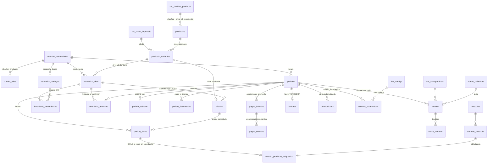

# EL ESQUELETO DE LA DESPENSA — modelo entidad-relación (S95-C, 11 Ago 2026)

> **Qué es esto.** El diseño de esquema del frente de productos, contrastado
> contra `MODELO_DESPENSA` v2.0, `BIO_EXPEDIENTE` E2bis/PE7, `MODELO_FINANCIERO`
> §7 y §8.10, `MODELO_LOYALTY` §5/§7 y el censo de S95-B.
>
> 🔴 **ESTE DOCUMENTO ES UN GATE. Ninguna migración se escribe hasta que el
> founder lo firme.** *Un error de pantalla se corrige en una tarde; uno de
> esquema se hereda.*
>
> **Cero DDL ejecutado. Cero migraciones. El árbol está quieto.**
>
> **Regla R5 rige el documento entero: lo que no está medido no se afirma.**
> Todo número salió de dos corridas de solo lectura contra la base linkeada el
> 11-ago-2026 (`scripts/s95/verificar-censo.mjs` y `-2.mjs`, 59 consultas, cero
> errores). Lo que no se pudo medir está en §8.

---

## 1 · BLOQUE 0 — el censo, verificado contra la base viva

**El censo de S95-B se sostiene en lo esencial y se corrige en siete puntos.**
Ninguna corrección tumba una decisión de la letra; dos de ellas **cambian el
plan de trabajo**.

### 1.1 Lo que se CONFIRMA tal cual

| Afirmación del censo | Medido hoy |
|---|---|
| `pedidos` 137 filas, 1-feb → 2-may-2026 | ✅ 137, mismo rango exacto |
| 35 con `pagado_en`, 30 con `kushki_charge_id`, 0 con `vtex_order_id` | ✅ los tres |
| `pedido_items` 0 filas · `productos` 0 · `seller_perfil` 0 · `seller_inventario` 0 · `facturas` 0 · `checkout_sesiones` 0 | ✅ los seis |
| `seller_comisiones`: 2 filas activas al **20,00 %**, `es_override`, del 2-may | ✅ idénticas, mismo `seller_id` |
| `fee_configs`: `seller_productos` EC y CO al **14 %**, `tipo_origen='pedido'`, activo desde 1-ene-2026 | ✅ las dos filas |
| `producto_asignacion` activo, `es_mvp`, `eje_jtbd='alimentacion'`, `tabla_tipada` **NULL**, **cero eventos** | ✅ todo |
| `procedencia`: 199 NULL · 84 familia · 12 prestador · **0 verificado_por_prestador** | ✅ exacto |
| 🔴 `pedidos` acepta INSERT con rol `{public}` y `anon` tiene el grant | ✅ las dos policies, el grant completo |
| Cero triggers de loyalty sobre `pedidos`; **una sola** función toca el ledger de puntos y **nadie la llama** | ✅ |
| **Cero patrón de idempotencia** en toda la base | ✅ cero columnas |
| Cero consumidores de tablas de comercio en el monorepo; cero constantes de comisión en código | ✅ grep en cero |
| `direcciones_guardadas` 2 filas · `cuenta_roles` 6, todas `prestador_servicios` · `seller_productos` ya en el enum | ✅ |

### 1.2 🔴 Las siete divergencias

**① `pedidos` tiene DOCE FKs entrantes, no cinco.** El censo listó
`devoluciones`, `envios`, `cupon_usos`, `facturas`, `checkout_sesiones`,
`resenas_productos`. Faltaban **`evento_inscripciones`**,
**`servicios_exequiales`**, **`tickets_soporte`**, `liquidacion_pedidos`,
`pedido_items` y `pedidos_recurrentes`.

> *`evento_inscripciones` y `servicios_exequiales` no aparecen en ninguna parte
> del censo: son otros dos frentes del legado colgando de la misma tabla.*
> **Lo que lo desactiva: las seis tienen CERO filas** (medido). El borrado
> sigue siendo factible; lo que cambia es que **la transacción tiene que mirar
> doce tablas, no cinco** (regla 41).

**② `zonas_cobertura` tiene 20 filas con tarifas reales — y `D-754` dice que
el flete «no tiene dato».** Medido: `tarifa_base` + `tarifa_kg` +
`tiempo_estimado_horas`, por ciudad, sector y transportista. Ejemplos:
Quito Norte con Picap **$3,00 + $0,40/kg, 2 h**; Guayaquil Samborondón con
Borzo **$5,50 + $0,75/kg**; Cuenca con Laar **$6,00 + $0,80/kg, 24 h**;
Loja **inactiva**.

> **No convierte a D-754 en pagada** —son datos de prototipo del 2-may y nadie
> los verificó contra un transportista real—, **pero sí cambia su enunciado:
> el MODELO de flete existe completo y con números plausibles. Lo que falta es
> la validación, no el diseño.** *La llamada al vendedor ahora arranca con una
> tabla en la mano en vez de una hoja en blanco.*

**③ `otorgar_puntos` YA NO es ejecutable por `anon`.** `D-314` y el censo dicen
que sí. Medido: `has_function_privilege('anon', …)` = **false**;
`authenticated` = true. **La mitad (1) de D-314 está parcialmente pagada** —
probablemente por el barrido de DEFINER de S92. *Lo que sigue abierto es el
gate de autorización en el cuerpo y la policy `pu_own`; no se re-audita acá.*

**④ Hay una tabla `vtex_sync_log` que el censo no contó**, con 0 filas y tres
índices. Las columnas `vtex_*` son **12 en tres tablas**, no ocho. Sin
consecuencia: todo vacío.

**⑤ `productos` tiene DOS columnas de vendedor, no una:** `seller_id → profiles`
**y** `seller_perfil_id → seller_perfil`. El censo solo nombró la primera. *La
inconsistencia de modelo que el censo señaló es peor de lo que reportó: la
misma tabla apunta a los dos conceptos a la vez.*

**⑥ `pedidos` tiene tres policies de UPDATE que el censo no listó**, y una es
funcional: `reclamar_pedidos_guest` (un usuario autenticado se apropia de un
pedido guest con su email). Se declara porque **muere con la cura de D-757**.

**⑦ `cuentas_comerciales` tiene 7 filas, 4 activas.** El censo no dio el número.
Ninguna tiene rol `seller_productos`.

### 1.3 🔴 Los dos hallazgos que el censo no fue a buscar y cambian el diseño

**A · `crear_evento_economico` YA está cableada para la despensa.** Medida en
su cuerpo, no leída:

```
v_tipo_actor_requerido := CASE p_origen_tipo
  WHEN 'pedido' THEN 'seller_productos'::tipo_actor_enum
  …
```

y el trigger `validar_origen_evento` resuelve `origen_tipo='pedido'` contra
**`SELECT 1 FROM pedidos WHERE id = NEW.origen_id`**.

> **Tres consecuencias duras:**
> 1. **La puerta financiera de la despensa existe y apunta a `pedidos`.** Eso
>    cierra la pregunta ③ del censo *(«¿cuál de los tres números manda?»)*: manda
>    **`fee_configs`**, porque es la única que el motor lee. `seller_comisiones`
>    es una tabla sin ningún camino de lectura.
> 2. **El pedido de la despensa DEBE vivir en `pedidos`.** Si naciera en una
>    tabla nueva, el trigger del ledger rebota el evento. *No es preferencia de
>    diseño: es el motor financiero exigiéndolo.*
> 3. **La cuenta del vendedor necesita el rol `seller_productos` ACTIVO o la
>    función LANZA** — y hoy hay cero filas con ese rol.

**B · `fee_configs` NO sabe sobre qué base calcula, y no lo puede saber.**
Medido: el porcentaje se aplica sobre `p_monto_bruto`, que **lo elige quien
llama**. No hay columna de base ni forma de derivarla.

> **Y `MODELO_FINANCIERO` §3.1 ya lo define: `monto_bruto` = GMV = «monto bruto
> pagado por el cliente final».** El cliente final paga el **total con IVA** ⇒
> **el 10 % sobre el total con IVA no exige ningún cambio del motor: exige que
> el llamador pase el total con IVA como `monto_bruto`.**
>
> **Lo que sí falta es que eso quede ESCRITO donde se lee.** Propuesta en §4.4:
> `parametros` gana la clave `"base"` y un CHECK la exige para
> `tipo_origen='pedido'`. *Cuesta una línea hoy; el día que alguien mire la
> tabla y vea `{"pct":10}` no va a poder saber sobre qué.*

---

## 2 · LOS PRINCIPIOS DEL DISEÑO

1. **Se enmienda lo vivo; jamás se forkea.** El peor resultado posible es una
   tabla al lado de una que ya existe (B0.5). Cada tabla del censo tiene su
   veredicto en §7.
2. **Nombres de la casa:** tablas en plural y en español, FKs con sufijo `_id`,
   catálogos con prefijo `cat_`, vistas `v_`, triggers `trg_*` sobre funciones
   `_trg_*`. Precios `numeric(10,2)`, montos del ledger `numeric(14,2)`.
   **Todo monto lleva su moneda al lado.**
3. **Append-only como lo hace esta casa:** no un trigger que prohíbe — **la
   ausencia de policy de escritura** + escritura exclusiva por funciones
   `SECURITY DEFINER`. Es el molde de `eventos_economicos` y `eventos_mascota`.
4. **Policies compuestas de HELPERS con nombre**, jamás de subqueries inline
   (es lo que D-700 vino a pagar).
5. **El cinturón servicios↔productos vive en el esquema.** Perdió su mitad con
   multa al salir de VTEX (`MODELO_DESPENSA` §3.4) ⇒ **cero FKs entre los dos
   dominios, y el juez lo verifica.**
6. **Lo que se protege hoy porque mañana es una migración con backfill:** la
   base del fee, el impuesto como dato, `devuelto`/`contracargo` como estados,
   el financiador del descuento, el modo de captura del evento (D-753) y la
   idempotencia.

---

## 3 · EL DIAGRAMA



**Lo que el diagrama dice y hay que leer dos veces:**

- **No hay ninguna línea entre el dominio de productos y el de servicios.** Ni
  `evento_cita_servicio`, ni `prestadores`, ni `evento_atencion`. **El único
  punto de contacto es `eventos_mascota`, y es de una sola dirección: el pedido
  deposita, jamás lee.**
- **`ofertas` toca `producto_variantes` con cardinalidad `o|`** — cero o una.
  Ahí vive «una sola oferta visible».
- **`pedido_items → evento_producto_asignacion` es opcional a propósito:** una
  cama no deposita nada.

---

## 4 · TABLA POR TABLA

### 4.1 Catálogo

| Tabla | Qué es | Estado | Letra que la exige |
|---|---|---|---|
| **`productos`** | El producto **canónico** de e-PetPlace: nombre, marca, familia, descripción, imágenes, y **los atributos que la recomendación necesita** | **SE ENMIENDA** | §3.3 · §6 · PE7 |
| **`producto_variantes`** | La presentación: 3 kg / 15 kg. Peso, contenido, GTIN, su tasa de impuesto | **NACE** | IV.0 del brief · §6 |
| **`vendedor_skus`** | Lo que el vendedor efectivamente tiene, con su código propio y su precio **propuesto** | **NACE** (absorbe `seller_inventario`) | §3.3 · §4.2 |
| **`ofertas`** | Lo visible: precio, país, moneda, estado. **UNA publicada por variante** | **NACE** | §4.1 · §4.2 |
| **`cat_familias_producto`** | alimento · antiparasitario · suplemento (+ las excluidas), **con la bandera `entra_al_expediente`** | **NACE** | §7.1 · E2bis |
| **`cat_tasas_impuesto`** | Tasa por código y país, con vigencia | **NACE** | costura §4.4 |

**Las cuatro decisiones de esta sección, con su razón:**

**(a) `productos` pierde `precio`, `stock`, `stock_minimo`, `seller_id`,
`seller_perfil_id`, `sku` y las tres `vtex_*`.** Hoy esa tabla es producto +
oferta + inventario + vendedor en una sola fila — exactamente lo que §3.3
prohíbe. **Con 0 filas el `DROP COLUMN` es gratis; con datos sería una
migración.**

**(b) La variante es TABLA, no el `variantes` jsonb que ya existe.** Un jsonb
no puede recibir FK desde `pedido_items` ni desde `vendedor_skus`, y sin eso es
inexpresable decir *«este SKU es la presentación de 15 kg»* — que es justo lo
que el cálculo de *«se acaba en 6 días»* necesita.

**(c) `seller_inventario` SE JUBILA en vez de reusarse, y ésta es la única
tabla donde contradigo el veredicto del censo.** Su razón: **su llave de actor
es `seller_id → profiles`.** El modelo de la casa dice que quien vende y cobra
es una **`cuenta_comercial`** (`MODELO_FINANCIERO` Decisión I y §2.6), y
`MODELO_DESPENSA` §8 firma que **el vendedor es un ROL sobre
`cuentas_comerciales`**. *Reusarla tal cual sería heredar precisamente el error
de modelo que la decisión de S95 vino a corregir.* Tiene 0 filas: jubilarla no
cuesta nada.

**(d) Los atributos de recomendación son columnas y arrays, no un jsonb libre.**
`especies_aplicables text[]`, `tallas_aplicables text[]`,
`momentos_aplicables text[]`, `ingredientes_activos text[]`,
`alergenos text[]`, `es_dieta_prescripcion boolean`. **Es el molde ya vivo de
la casa** (`tipos_servicio.especies_elegibles` de S57 y
`cat_conductas_bitacora.especies_aplicables` de S91). *Un jsonb libre no se
puede indexar por contenido ni verificar, y la exclusión dura por alergia de §6
tiene que ser verificable.*

**El estado de la propuesta (§4.2), en `vendedor_skus`:**
`propuesto → en_revision → aceptado | rechazado`. **Publicar es un acto
distinto y vive en `ofertas`**, con `publicado_por` (el admin) separado de
`propuesto_por` (el vendedor). **El origen del dato queda declarado** en
`origen_carga`: `vendedor` · `epetplace` · `asistido_por_ia`.

**Una oferta por VARIANTE, no por producto.** §4.1 dice «una oferta visible por
producto»; **si la unidad fuera el producto canónico, vender 3 kg y 15 kg sería
imposible.** Lo que §4.1 prohíbe son siete precios para la **misma cosa**, y la
misma cosa es la variante. Se materializa con
`UNIQUE (variante_id) WHERE estado = 'publicada'` — *el estado «dos ofertas
visibles» queda inexpresable, no vigilado.*

### 4.2 Inventario

| Tabla | Qué es | Estado |
|---|---|---|
| **`inventario_movimientos`** | El ledger: ingreso · ajuste · reserva · liberación · consumo · merma. **Append-only** | **NACE** |
| **`inventario_reservas`** | Bloqueo **al confirmar**, con `expira_en`. Una por (pedido, sku) | **NACE** |
| **`vendedor_bodegas`** | Origen de despacho. **Una en v1, modelada como N** | **NACE** |

**El stock disponible se MATERIALIZA en `vendedor_skus` por trigger desde el
ledger** — el ledger es la fuente de verdad, la columna es lectura rápida. *Es
el mismo patrón que `mascota_perfil_vigente` sobre `eventos_mascota`: nadie
recorre el timeline para saber qué alergias tiene Thor hoy.*

**La reserva expira sola por lectura perezosa, con cron solo de higiene** —
patrón del hold de agenda de S54: *la expiración perezosa es correctitud; el
cron es limpieza.*

**El inventario NO se parte por bodega en v1** (declarado): `bodega_id` viaja en
el movimiento y en el envío, pero el saldo es por SKU. Partirlo con una sola
bodega es complejidad sin uso.

### 4.3 Pedido

| Tabla | Qué es | Estado |
|---|---|---|
| **`pedidos`** | Cabecera. **Es la tabla que el motor financiero exige** (§1.3-A) | **SE ENMIENDA** |
| **`pedido_items`** | Las líneas. La normalización que el legado dejó a medias | **SE ENMIENDA** (se termina) |
| **`pedido_estados`** | La máquina de estados, **append-only, con quién lo movió** | **NACE** |
| **`cat_estados_pedido`** | El vocabulario cerrado, **incluidos `devuelto` y `contracargo`** | **NACE** |
| **`pedido_descuentos`** | La línea que **declara quién la financia**. Nace apagada | **NACE** |

**`pedidos` GANA:** `cuenta_comercial_id` (el vendedor — hoy no existe),
**`moneda`** (hoy no existe: hallazgo del censo — *una tabla de plata sin
moneda es una decisión que se paga el día del segundo país*),
`subtotal_sin_impuesto`, `impuesto_total`, `costo_envio`, `metodo_entrega`,
`clave_idempotencia UNIQUE`, y el **snapshot de entrega** (receptor, teléfono,
dirección, sector, referencias, lat/lon) **todo NULLABLE porque el retiro en
tienda no tiene dirección**.

> **El snapshot, no la FK.** Precedente D-339: la cita guarda la dirección, no
> la referencia. *Una dirección editada seis meses después no puede cambiar a
> dónde se entregó algo.*

**`pedidos` PIERDE:** `kushki_token`, `kushki_charge_id`, `kushki_status`,
`kushki_response` (van a `pagos_intentos`, agnóstico), `vtex_order_id`,
`tracking_code` y `courier` (duplican `envios`), `items` jsonb (los ítems son
`pedido_items` — **es la migración que el legado dejó a medias y que esta tanda
termina**), `recurrente_id` y `es_programado` (suscripción está fuera de v1).

**`pedidos.estado` deja de ser una columna que se pisa.** Nace
`pedido_estados` append-only y `pedidos.estado` pasa a ser
**materializada por trigger** desde la última fila — el mismo patrón del
inventario. **Hoy `estado` no tiene ni CHECK** (medido): el vocabulario pasa a
`cat_estados_pedido`, con `devuelto` y `contracargo` incluidos **aunque el
flujo de devolución no se construya en v1**, porque `BIO_EXPEDIENTE` E2bis dice
que *«un pedido devuelto deposita otro evento que lo corrige»* y esa letra
necesita de dónde colgarse.

**`pedido_items` GANA:** `variante_id`, `oferta_id`, `cuenta_comercial_id`
(reemplaza `seller_id → profiles`), `impuesto_codigo`, `impuesto_pct`,
`impuesto_monto`, `moneda`. **El precio se congela en la línea** (ya tiene
`precio_unitario` y `subtotal`) — precedente del precio congelado de la cita.

### 4.4 Plata

**① La comisión: fila nueva, jamás UPDATE sobre la vigente.**

```
UPDATE fee_configs SET vigencia_hasta = <fecha de firma>
  WHERE tipo_actor='seller_productos' AND country_code='EC';   -- la del 14 %
INSERT INTO fee_configs (…, parametros = '{"pct":10,"base":"total_con_impuesto"}',
                         vigencia_desde = <fecha de firma>);
```

**Por qué así y no pisando el 14 %:** `fee_configs` es infraestructura viva con
historial auditado por trigger, y `eventos_economicos` guarda `fee_config_id`
como snapshot. **Pisar un valor vigente borra la trazabilidad de qué se cobró
antes.** Y medido en `_resolver_fee_aplicable`: el desempate final es
`vigencia_desde DESC`, así que **cerrar la vigencia de la vieja hace que la
resolución sea determinista en vez de depender de un desempate.**

**La de Colombia NO se toca** — Colombia no lanza y su 14 % no molesta a nadie.

**② La base del cálculo, escrita donde se lee.** `parametros` gana la clave
`"base"` y un CHECK la exige cuando `tipo_origen='pedido'`. *No cambia el motor
—que ya aplica el pct sobre `monto_bruto`— pero vuelve imposible que alguien
mire `{"pct":10}` dentro de un año y no sepa sobre qué.* **Las comisiones de
servicios no se tocan.**

**③ El impuesto es DATO, jamás constante.** `cat_tasas_impuesto` (código, país,
pct, vigencia); la variante declara su `impuesto_codigo`.

> **Por qué no alcanza `country_config.iva_pct`, que ya existe:** es **UNA tasa
> por país** (EC: 15,00). Ecuador tributa **0 %** varios alimentos y **15 %** el
> resto — y `facturas` ya tiene `subtotal_0`, `subtotal_12` y `subtotal_15`,
> *que es la historia del IVA ecuatoriano hecha columna y la prueba de que una
> sola tasa nunca alcanzó.*

**④ La factura del vendedor se REGISTRA, no se emite.** `facturas` **ya está
preparada**: tiene `ruc_emisor`, `razon_social_emisor`, `numero_factura`,
`clave_acceso`, `pdf_url`, `xml_url` y los campos del SRI. Gana
`emitida_por_tercero boolean` (default true en la despensa). *Sin esto,
atención al cliente queda ciega ante el primer reclamo.*

**⑤ La liquidación entra por `eventos_economicos`** — la puerta que el motor de
servicios ya usa y que **ya tiene `tipo_origen='pedido'` previsto**. No se
revive `seller_liquidaciones`/`liquidacion_pedidos`: **dos sistemas de
liquidación en la misma base es la clase de deuda que este esqueleto existe
para no crear.**

> 🔴 **Y acá hay una pregunta de modelo que NO decido yo — es la #1 de §9.**

### 4.5 Puente al expediente

| Tabla | Qué es | Estado |
|---|---|---|
| **`evento_producto_asignacion`** | La tabla tipada de detalle. Hoy `tabla_tipada` es NULL | **NACE** |
| `cat_tipos_evento` | `producto_asignacion` gana su `tabla_tipada` | **SE ENMIENDA** (una fila) |
| `eventos_mascota` | Gana `modo_captura` (D-753) y el CHECK de procedencia | **SE ENMIENDA** |

**Columnas de `evento_producto_asignacion`:** `evento_id` (FK RESTRICT al hito
— el molde de las otras 40 tablas tipadas), `mascota_id`, `producto_id`,
`variante_id`, `pedido_item_id`, `cantidad`, `presentacion`, `peso_kg`,
`fecha_compra`, **`duracion_estimada_dias`** (el *«se acaba en 6 días»*),
**`periodicidad_dias`** (el antipulgas), `country_code`.

**Tres guards, los tres en el esquema:**

1. **`procedencia` obligatoria para este tipo.** No se puede hacer NOT NULL
   global —hay 199 filas viejas en NULL— así que va un CHECK condicional:
   `(tipo <> 'producto_asignacion' OR procedencia IS NOT NULL)`. *No rompe
   nada vivo y hace inexpresable el evento de compra sin fuente.*
2. **Siempre `declarado_por_familia`.** Una compra la aporta la familia, jamás
   un profesional (E2bis condición 2).
3. **La frontera vive en `cat_familias_producto.entra_al_expediente`**, no en un
   documento. *El criterio de E2bis —«entra lo que cambia el cuerpo o el riesgo
   sanitario»— deja de re-discutirse cada vez porque es una columna.*

**`modo_captura` (D-753):** `tecleado` · `dictado` · `extraido_por_ia` ·
`automatico`, **NULLABLE** — los 295 eventos vivos no lo declaran y fingir que
sí sería inventar dato. **Hoy es una columna; con miles de eventos vivos es una
migración con backfill.**

### 4.6 Permisos

| Pieza | Qué |
|---|---|
| **`es_vendedor_de(cuenta_comercial_id)`** | Helper nuevo, DEFINER STABLE, `search_path` fijo. **Nace porque no existe** (medido: la casa tiene `user_gestiona_prestador`, no su gemelo comercial) |
| **RLS en las 11 tablas nuevas** | Desde el primer día. **Cero policies `ALL` para nadie** |
| **D-757** | Las dos policies de INSERT `{public}` de `pedidos` mueren; nace una `TO authenticated` con `auth.uid() = user_id`. Mueren también `pedidos_select_guest` (`USING false`, policy muerta) y `reclamar_pedidos_guest` (sin guest no hay qué reclamar) |
| **El rol `seller`** | **Cero grants sobre tablas del expediente. El juez lo verifica** (invariante 4) |

**Nota de regla 78 (grants contra bundles vivos):** medido que **cero código
del monorepo consume estas tablas**. El portal admin y las webs del legado
comparten la base y **no los pude medir** — pero el admin opera con `is_admin()`,
no con `anon`, y el founder confirmó que el legado está muerto. **Riesgo bajo y
declarado, no descartado.**

### 4.7 Logística

**Se enmienda lo que existe. No se reconstruye nada.**

| Tabla | Qué cambia |
|---|---|
| **`envios`** | `seller_id → profiles` pasa a `cuenta_comercial_id` · gana `metodo` (`despacho` \| `retiro`, retiro **apagado** en v1) · `moneda` para `costo_envio` · `bodega_id` · `promesa_entrega_desde/hasta` |
| **`cat_transportistas`** | **NACE**: el CHECK con lista fija (`picap`, `borzo`, `servientrega`, `laar`, `tramaco`, `propio`, `otro`) pasa a catálogo (regla 21) |
| `envio_eventos` | **SIRVE TAL CUAL** — historial con estado, ciudad, lat/lon y fuente |
| `zonas_cobertura` | **SIRVE TAL CUAL** — es el modelo de flete de D-754 (§1.2-②) |

**La promesa de entrega se guarda.** `envios` ya tiene `entrega_programada` y la
ventana horaria; se completa con la promesa al momento de la compra. *Si no
está, la pantalla la inventa — y `L-139` prohíbe el dato verosímil-falso.*

**El costo de envío es DATO, no motor.** `envios.costo_envio` ya existe; el
cálculo vive fuera del esquema. Tarifa plana hoy, `zonas_cobertura` mañana, sin
tocar una tabla.

### 4.8 La pasarela — agnóstica de verdad

| Tabla | Qué |
|---|---|
| **`pagos_intentos`** | `pedido_id`, `proveedor`, `proveedor_referencia`, `monto`, `moneda`, `estado`, **`forma`** (`tokenizacion` \| `redireccion`), `url_redireccion`, `payload_crudo` jsonb, `clave_idempotencia`, timestamps |
| **`pagos_eventos`** | Los webhooks, **append-only**, con `clave_idempotencia UNIQUE` |

**El dominio jamás sabe quién cobra.** Ninguna columna se llama por un
proveedor — y por eso `pedidos` pierde sus cuatro `kushki_*`: *un patrón de
columnas por proveedor envejece mal el día que la pasarela cambia, y ya cambió
una vez.*

**Las dos formas desde el día uno.** Una billetera con redirección y QR tiene
forma distinta que una tokenización de tarjeta. **Diseñar solo para tarjeta
convierte la primera billetera en una reescritura.** El proveedor todavía no
está elegido: **si el esqueleto dependiera de cuál sea, estaría mal diseñado.**

**La idempotencia, inventada acá porque no hay precedente en casa** (medido:
cero columnas `idempot*`, `request_id`, `external_id` o `dedupe` en toda la
base): **`clave_idempotencia text UNIQUE`** en `pedidos`, `pagos_intentos` y
`pagos_eventos`. *Un webhook que llega dos veces no puede crear dos pedidos, y
ese defecto se descubre con un cliente real enojado del otro lado.*

---

## 5 · LAS CUATRO COSTURAS — se dejan con forma, no se encienden

| Costura | Dónde queda | Por qué hoy |
|---|---|---|
| **El financiador del descuento** | `pedido_descuentos.financiado_por` (`vendedor` \| `epetplace`) | En Forma B el vendedor factura: **si e-PetPlace regala 15 %, nadie decidió si lo absorbe él o sale de nuestro 10 %.** Sin el campo, la primera liquidación es una discusión. *(Y que un beneficio se pueda gastar comprando **no** convierte a la compra en fuente de loyalty.)* |
| **Impuesto como dato** | `cat_tasas_impuesto` + `producto_variantes.impuesto_codigo` | §4.4-③ |
| **`devuelto` y `contracargo`** | `cat_estados_pedido` | E2bis necesita de dónde colgar el evento correctivo |
| **Idempotencia y expiración** | `clave_idempotencia` + `inventario_reservas.expira_en` | §4.8 |

---

## 6 · EL JUEZ — los once invariantes

Se escribe **antes** del esquema y arranca todo rojo.
*Un juez escrito después es un juez escrito para aprobar lo que ya hiciste.*

| # | Invariante | Cómo se mide |
|---|---|---|
| 1 | RLS activa en toda tabla del frente · **cero policies `ALL`** | `pg_class.relrowsecurity` + `pg_policies.cmd` |
| 2 | 🔴 **Cero FKs entre el dominio de productos y el de servicios** | `pg_constraint` cruzando las dos listas de tablas |
| 3 | **Ningún camino de escritura de un pedido al motor de puntos** | cero triggers sobre las tablas del pedido + cero funciones que toquen ambos |
| 4 | El rol `seller` **sin grants sobre tablas del expediente** | `role_table_grants` + policies que lo nombren |
| 5 | La comisión es **fila de `fee_configs` vigente**; cero constantes en código | consulta + grep |
| 6 | **`producto_asignacion` sigue siendo UNO** | `count(*) FROM cat_tipos_evento WHERE codigo LIKE '%producto%'` |
| 7 | Tablas de estado y de movimiento **sin permiso de UPDATE** | ausencia de policy de UPDATE (append-only de verdad, no por convención) |
| 8 | **Toda columna de monto con su moneda al lado** | `information_schema.columns` |
| 9 | La línea de descuento **declara su financiador** | columna NOT NULL |
| 10 | **Cero tablas nuevas que dupliquen una del censo** | lista contra lista |
| 11 | **`pedidos` sin INSERT anónimo** | policies + grants de `anon` |

> 🔴 **Un juez en rojo es un hallazgo, no un obstáculo.** Si un test no pasa se
> frena y se eleva. **Jamás se ablanda el test, jamás se comenta, jamás se marca
> como excepción** — es `L-192`: todo chequeo tiene que poder salir rojo.

### 6.1 La línea base — **2 en verde, 9 en ROJO** (`scripts/s95/juez-despensa.mjs`)

| # | | Por qué |
|---|---|---|
| 1 | ❌ | Faltan las 14 tablas nuevas · **7 policies `ALL`** vivas en el frente |
| 2 | ❌ | **Dos FKs cruzan el cinturón** — ver §6.2 |
| 3 | ✅ | Cero triggers y cero funciones conectan un pedido con el motor de puntos |
| 4 | ✅ | Ninguna policy del expediente resuelve por vendedor; ningún helper por `seller_productos` |
| 5 | ❌ | El pct vigente es **14**, la letra firma 10 · el parámetro `base` no existe |
| 6 | ❌ | `producto_asignacion.tabla_tipada` sigue en NULL — **el detalle no tiene casa** |
| 7 | ❌ | Faltan las tres append-only · **`envio_eventos` admite UPDATE y DELETE a `anon`** |
| 8 | ❌ | **Siete tablas con montos huérfanos**, `pedidos` entre ellas |
| 9 | ❌ | `pedido_descuentos.financiado_por` no existe |
| 10 | ❌ | **Las 17 jubiladas siguen vivas, las 17** |
| 11 | ❌ | Las dos policies de INSERT `{public}` y los cuatro grants de escritura de `anon` |

**Los dos verdes son honestos y hay que leerlos con su límite:** miden que hoy
*no hay* camino de la compra al loyalty ni del vendedor al expediente. **Eso se
cumple por ausencia de productor, no por un guard** (el censo §6.8 lo dijo) —
el valor del invariante es que **a partir de ahora el día que alguien lo cablee,
el juez lo dice.**

### 6.2 🔴 EL VERDE FLOJO QUE EL JUEZ CAZÓ EN SU PRIMERA CORRIDA

**El invariante 2 salió VERDE en la primera pasada, y era falso.** Pasaba
porque mi lista de tablas de servicios era corta: no incluía las dos que cruzan
de verdad. *Un invariante verde porque su lista es corta es peor que uno rojo —
dice un número más chico, y en un chequeo eso se lee como progreso.* Corregida
la lista **por medición de columnas, no por nombre**, salieron dos cruces:

| Cruce | Qué es | Veredicto |
|---|---|---|
| **`servicios_exequiales` → `pedidos`** | Tiene `prestador_id`, `fecha_servicio`, `direccion_recogida`, `certificado_url`. **Es un SERVICIO cobrado por la tabla de pedidos de producto.** | 🔴 **VIOLACIÓN REAL del cinturón.** 0 filas. Se jubila la tabla o se le quita la FK |
| **`tickets_soporte` → `pedidos`** | Tiene `pedido_id` **y** `cita_id`, sin `prestador_id`. **Es soporte: ni pedido ni cita.** | ⚖️ **Probablemente NO es violación** — es transversal por naturaleza y no produce SKU |

> **No toco la lista del juez para que se ponga verde.** El segundo caso es una
> **decisión de clasificación, y la lista ES el test**: cambiarla sin decirlo
> sería exactamente el ablandamiento que §6 prohíbe. **Va a §9 como pregunta
> ⑦.**

---

## 7 · VEREDICTO POR OBJETO

| Objeto | Veredicto | Motivo en una línea |
|---|---|---|
| `pedidos` | **SE ENMIENDA** | El motor financiero la exige por nombre (§1.3-A). Gana moneda, vendedor e impuesto; pierde kushki, vtex y el jsonb de ítems |
| `pedido_items` | **SE ENMIENDA** | Se termina la normalización que el legado dejó a medias |
| `productos` | **SE ENMIENDA** | Pasa a ser el canónico puro: pierde precio, stock, vendedor y sku |
| `seller_inventario` | ☠️ **SE JUBILA** | Su llave de actor es `profiles`; el modelo de la casa exige `cuentas_comerciales` (§4.1-c) |
| `seller_comisiones` | ☠️ **SE JUBILA** (D-748) | **Cero caminos de lectura** — el motor lee `fee_configs`. Sus dos filas al 20 % se desactivan con su razón escrita |
| `seller_perfil` | ☠️ **SE JUBILA** | El vendedor es un ROL sobre `cuentas_comerciales` (§8), no un perfil aparte. 0 filas |
| `seller_documentos` · `seller_reglas_asignacion` · `mensajes_admin_seller` · `pedidos_recurrentes` · `resenas_productos` · `wishlist` · `lista_espera` · `planes_nutricion` · `cupones` · `cupon_usos` · `checkout_sesiones` · `vtex_sync_log` | ☠️ **SE JUBILAN** | Fuera del alcance v1, 0 filas, cero consumidores |
| `seller_liquidaciones` · `liquidacion_pedidos` | ☠️ **SE JUBILAN** | Vía paralela al ledger. **Dos sistemas de liquidación es la deuda que este esqueleto existe para no crear** |
| `envios` · `envio_eventos` | **SE ENMIENDAN** | La logística ya está construida — se reusa |
| `zonas_cobertura` | **SIRVE TAL CUAL** | Es el modelo de flete de D-754, con 20 filas de dato (§1.2-②) |
| `facturas` | **SE ENMIENDA** | Ya tiene los campos del emisor tercero y del SRI |
| `devoluciones` | **SE ENMIENDA** | v1 no automatiza el flujo; la tabla y los estados existen |
| `direcciones_guardadas` | **SIRVE TAL CUAL** | Se usa por **snapshot**, jamás por referencia (D-339) |
| `cuentas_comerciales` · `cuenta_roles` | **SIRVEN TAL CUAL** | `seller_productos` ya está en el enum; falta la primera fila |
| `eventos_economicos` · `fee_configs` | **SIRVEN TAL CUAL** | Es la puerta del dinero y ya conoce `origen_tipo='pedido'` |
| `productos_comerciales` | **NO ES DESPENSA** | Es lo que la plataforma le vende a sus actores. No confundir |
| Las 12 columnas `vtex_*` | ☠️ **SE JUBILAN** | Cero valores, cero lecturas, cero escrituras |
| Los 137 pedidos + 5 envíos + 5 devoluciones | ☠️ **SE BORRAN** | El founder confirmó que son simulados. Doce FKs a mirar, seis de ellas vacías (§1.2-①) |

**Nacen 13 tablas:** `producto_variantes` · `vendedor_skus` · `ofertas` ·
`cat_familias_producto` · `cat_tasas_impuesto` · `inventario_movimientos` ·
`inventario_reservas` · `vendedor_bodegas` · `pedido_estados` ·
`cat_estados_pedido` · `pedido_descuentos` · `pagos_intentos` ·
`pagos_eventos` · `cat_transportistas` · `evento_producto_asignacion`.
*(Son 15 contando los dos catálogos de logística e impuesto — se listan las 15
en el orden de migración de §10.)*

**Se jubilan 17.** *La despensa nace con menos tablas que las que apaga.*

---

## 8 · LO QUE NO PUDE MEDIR

1. **El portal admin y las webs del legado.** Comparten esta base y viven en
   otros repos. **«Cero consumidores en el monorepo» no es «cero
   consumidores».** Toca directamente al veredicto SE JUBILA de 17 objetos y a
   la cura de D-757.
2. **Si los 30 cargos de Kushki existieron.** El founder ya lo respondió (son
   simulados) y por eso el borrado procede; **la base no lo sabe.**
3. **Si las 20 tarifas de `zonas_cobertura` son reales o inventadas.** Tienen
   forma plausible y transportistas ecuatorianos de verdad; **nadie las verificó
   contra un proveedor.**
4. **Cuánto pesa cada presentación en la práctica** — el `duracion_estimada_dias`
   necesita porción por talla, y eso sale del vendedor, no del esquema.

---

## 9 · 🔴 LAS PREGUNTAS QUE NECESITAN FIRMA

> ### ✅ CUATRO FIRMADAS POR EL FOUNDER (11-ago-2026)
>
> **① El ledger en Forma B: (c) FEE PURO CON LA CUENTA EN METADATA.**
> `monto_bruto` = la comisión · cuenta comercial NULL · payout NULL ·
> `metadata.cuenta_comercial_id` y `metadata.venta_total`.
> **⇒ D-750 queda pagada en su mitad de esquema:** la despensa entra al P&L
> como **fee**, y el ledger no puede decir otra cosa.
> **Consecuencia declarada y NO construida:** la liquidación al vendedor deja
> de existir y en su lugar hay una **cuenta por cobrar**. *Esta tanda deja el
> evento honesto; la cobranza es trabajo de otra.*
>
> **② Los 137 pedidos, sus 5 envíos y sus 5 devoluciones SE BORRAN JUNTOS**,
> en una transacción, respetando el orden de las doce FKs.
>
> **③ Las 20 tarifas de `zonas_cobertura` SE CONSERVAN, MARCADAS SIN
> VERIFICAR.** *Es más dato del que D-754 dice tener, y la marca impide que
> alguien las tome por firmadas.*
>
> **④ EL IMPUESTO ES CATÁLOGO DE TASAS POR PRODUCTO** (`cat_tasas_impuesto`),
> no una constante ni la única tasa de `country_config`.
>
> **⑤ y ⑥ quedan tomadas por el arquitecto** (regla 3 — decisión técnica con
> análisis claro), con su razón escrita abajo y reversibles si el founder las
> corrige: la oferta es **por variante**, y **lo nuevo va en español mientras
> lo enmendado conserva su nombre**.

### ① EL SIGNO DEL LEDGER EN FORMA B — la única que cambia el significado de una entidad

En Forma B **la plata no pasa por e-PetPlace: el vendedor cobra y nos debe la
comisión.** Pero `eventos_economicos` está construido para lo contrario —
`chk_suma_montos` exige `bruto − kushki − plataforma = payout`, y
`chk_payout_consistente` exige payout NOT NULL si hay cuenta comercial.

Sobre una venta de USD 100 + IVA (cobro 115):

| | `monto_bruto` | `monto_plataforma` | `monto_payout` | Qué dice el P&L |
|---|---:|---:|---:|---|
| **(a) Como una cita** | 115 | 11,50 | 103,50 | **GMV 115.** Y el payout de 103,50 es ficticio: nunca se lo pagamos, él ya lo tiene |
| **(b) Revenue puro plataforma** (cuenta NULL) | 11,50 | 11,50 | NULL | **GMV 11,50 = el fee, que es la verdad.** Pero se pierde a QUIÉN se le cobra en el evento |
| **(c) (b) + la cuenta en metadata** | 11,50 | 11,50 | NULL | Igual que (b), con `metadata.cuenta_comercial_id` y `metadata.venta_total` |

**Mi voto: (c).** **D-750 dice literal que la despensa entra al P&L como FEE, no
como GMV**, y (a) infla el ingreso proyectado un orden de magnitud —*no es un
error contable, es un error de decisión*. (c) conserva el dato del vendedor sin
mentirle al ledger.

**Lo que (c) deja abierto y hay que saber:** la liquidación al vendedor deja de
existir y en su lugar hay una **cuenta por cobrar**. *No la construyo en esta
tanda; solo dejo el evento honesto.*

### ② LOS 137 PEDIDOS — ¿se van también sus envíos y devoluciones?

Confirmaste que los pedidos son simulados. Colgando de ellos hay **5 `envios` y
5 `devoluciones` con datos** (una devolución «reembolsada» por $65,00).
**Mi voto: se van los tres juntos** — son del mismo prototipo del 2-may. Las
otras diez tablas que apuntan a `pedidos` están vacías.

### ③ LAS 20 TARIFAS DE FLETE — ¿se conservan?

`zonas_cobertura` tiene un modelo de flete completo con números plausibles.
**Mi voto: se conservan, marcadas como no verificadas.** *D-754 dice «sin
dato»; con esto arranca con una tabla en la mano.* Si preferís tierra limpia,
se borran con el resto.

### ④ EL IMPUESTO — ¿catálogo de tasas, o 15 % para todo en v1?

`country_config.iva_pct` da **una** tasa por país; Ecuador tributa 0 % varios
alimentos. **Mi voto: catálogo de tasas.** Es una tabla de cinco columnas hoy y
una migración con recálculo de facturas emitidas después.

### ⑤ UNA OFERTA POR **VARIANTE**, NO POR PRODUCTO — ¿confirmás la lectura?

§4.1 dice «una oferta visible por producto». Si la unidad fuera el producto
canónico, **vender 3 kg y 15 kg del mismo alimento sería imposible.**
**Mi lectura: lo que se prohíbe son siete precios para la misma cosa, y la
misma cosa es la presentación.**

### ⑦ 🔴 LOS DOS CRUCES DEL CINTURÓN (hallazgo del juez, §6.2)

**`servicios_exequiales` → `pedidos`.** Un servicio con prestador, fecha y
dirección de recogida, cobrado por la tabla de pedidos de producto. **Es la
violación exacta que §3.4 prohíbe**, viva desde antes de esta tanda. **0 filas.**
**Mi voto: se jubila la tabla entera** — es un frente muerto (0 filas, cero
consumidores en el monorepo) y la despensa no lo hereda. Si preferís
conservarla, la alternativa es quitarle la FK y dejarla sin camino al pedido.

**`tickets_soporte` → `pedidos`.** Tiene `pedido_id` **y** `cita_id`, y **no
tiene `prestador_id`**: es soporte, ni pedido ni cita. **Mi lectura: no es
violación del cinturón** — el cinturón prohíbe que un objeto de servicios
produzca un SKU o comparta tabla con el pedido, y un ticket no hace ninguna de
las dos. **Mi voto: sale de la lista de servicios del juez, con esta razón
escrita.** *Lo elevo en vez de editarlo yo porque la lista ES el test: cambiarla
en silencio para que se ponga verde es exactamente lo que §6 prohíbe.*

### ⑥ NOMBRES — ¿español en lo nuevo, aunque la base quede mixta?

Lo que nace va en español (`vendedor_skus`, `ofertas`, `inventario_movimientos`);
lo que se enmienda **conserva su nombre** (`pedidos`, `envios`, `facturas`,
`seller_*` donde sobreviva). **Mi voto: sí** — renombrar tablas vivas cuesta y
no compra nada. *La base queda mixta a propósito y por escrito, que es distinto
de quedar mixta por descuido.*

---

## 10 · EL ORDEN DE MIGRACIÓN — si esto se firma

**Una por dominio, con el juez corrido y reportado entre cada una.**

| # | Migración | Qué toca |
|---|---|---|
| 0 | **El juez** | `scripts/s95/juez-despensa.mjs`. **Sale rojo y ése es su primer verde** |
| 1 | **Limpieza** | Los 137 pedidos y sus 10 filas hijas · `seller_comisiones` · las 12 columnas `vtex_*` · las 17 tablas jubiladas · **D-757** |
| 2 | **Catálogo** | `cat_familias_producto` · `cat_tasas_impuesto` · `productos` enmendada · `producto_variantes` · `vendedor_skus` · `ofertas` |
| 3 | **Inventario** | `vendedor_bodegas` · `inventario_movimientos` · `inventario_reservas` + el trigger de materialización |
| 4 | **Pedido** | `cat_estados_pedido` · `pedidos` enmendada · `pedido_items` enmendada · `pedido_estados` · `pedido_descuentos` |
| 5 | **Plata** | `fee_configs` (vigencia + base) · `facturas` enmendada · `pagos_intentos` · `pagos_eventos` |
| 6 | **Logística** | `cat_transportistas` · `envios` enmendada |
| 7 | **Expediente** | `evento_producto_asignacion` · `cat_tipos_evento` (una fila) · `eventos_mascota` (CHECK + `modo_captura`) |
| 8 | **Barrido de RLS y grants** | El repaso final contra los once invariantes |

**Cada una con reversa escrita ANTES, declaración 76(g) de veda, y cinturón con
discriminador** — un cinturón que no puede salir rojo no es un cinturón.

---

## 11 · LO QUE ESTE DOCUMENTO NO HACE

1. **No autoriza construir.** Es el gate, no la migración.
2. **No toca `apps/`, `packages/` ni una sola pantalla.** Esta tanda es
   esquema, no producto.
3. **No decide las seis preguntas de §9.** Esa firma es del founder.
4. **No construye:** pantallas · integración real con una pasarela · IA de
   carga · suscripciones · segundo vendedor · carrito unificado con servicios ·
   flujo de devolución · motor de cálculo de flete · búsqueda con filtros · la
   UI del portal admin.

> 🔴 **Y el riesgo que hay que releer antes de firmar:** *lo que hace viable
> octubre es la lista de exclusiones.* **Deja de ser una limitación y pasa a ser
> el andamio que sostiene la decisión de S95.** El riesgo de esta tanda no es
> técnico: **es que «la despensa» se convierta en «una plataforma de
> e-commerce».**
